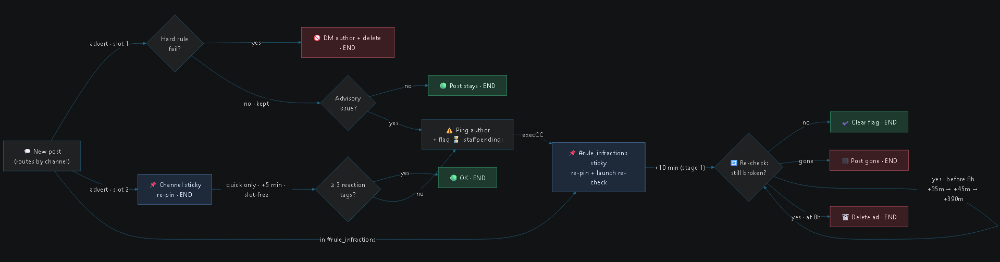

# 🐉 RPC YAGPDB Bot

This project holds the custom-command code running on the RPC YAGPDB bot. It
automates common staff tasks — mostly advert-channel enforcement — so staff
don't have to hand-check every post.

## 🗺️ Layout

Each folder holds the Go template that gets pasted into the YAGPDB dashboard, a
`setup.txt` with install instructions, and screenshots of the dashboard
settings.

The three advert commands ship in two forms: the readable original
(`quick_advert.go`) and a minified single-line version (`quick_advert.min.go`).
**The minified file is the one you paste into YAGPDB** — it's the same logic with
the comments and whitespace stripped so it fits the dashboard's code limit. Edit
the readable `.go`, then re-minify (see [Making changes](#-making-changes)).

## ✨ Features

### 📢 Advert enforcement — [consolidated_advert_commands](consolidated_advert_commands/)

One command per advert channel type (**quick**, **one-on-one**, **group**), each
running the whole check pipeline on every post:

- **Hard rules — delete the post + DM the author:** over the length limit,
  posting again before the cooldown expires, or already having an advert in that
  channel.
- **Advisory rules — keep the post + one ping in #rule_infractions:** links
  (quick), images/attachments (quick & 1x1), Discord headers (quick & 1x1; group
  allows a single short header line), banned words, and
  the same advert copy-pasted across more than one channel.

Folding every check into a single per-channel command keeps each advert channel
under YAGPDB's cap of 3 message-triggered commands per post.

### ✅ Quick-advert reaction requirement — [quick_reactions](quick_reactions/)

Quick adverts must carry at least three approved roleplay reaction tags. A few
minutes after a post, `reaction_check` re-reads it and, if it's short on tags,
pings the author in #rule_infractions to add them. `reaction_check` is a
trigger-type-**None** command (it never fires on its own), so it costs no
message-trigger slot.

The +5-minute timer that arms it is folded into the **quick-channel sticky**
([quick_sticky](quick_sticky/)) rather than a standalone "Post Timer" command.
That drops the quick channels from 3 message-triggered commands (advert cmd +
sticky + timer) to **2** (advert cmd + sticky), so every advert channel type now
sits at 2 of YAGPDB's 3 slots.

### 🧹 Advert reaction cleanup — [autoremove_reactions](autoremove_reactions/)

On the advert channels, reactions added by anyone who isn't the original poster
or a staff member are removed automatically, and staff-only emojis are protected
from non-staff use.

### 📌 #rule_infractions sticky — [infractions_sticky](infractions_sticky/)

Keeps the sticky pinned to the bottom of #rule_infractions even though the bot's
own infraction pings would otherwise bury it — a plain sticky's `.*` trigger
never fires on the bot's own messages, so the advert commands re-pin it via
`execCC` right after they post a ping.

### 🚩 Repeat-infraction tracking — [infractions_sticky](infractions_sticky/)

Counts each member's infractions over a rolling **6-month** window — stored as a
single per-user list of records (`infractionLog`; each record holds the time, a
comma-joined reason such as "headers, banned word", and the offending post's
channel/message id for a jump link), pruned on every write, so there's one DB row
per person rather than one per infraction. On the **3rd** infraction the notice
gains a warning line; on the **4th** — and **every infraction after** — the member
is suspended from posting adverts for **14 days** (a self-expiring `advertBan`
flag the advert commands check before accepting a post) and a heads-up goes to
bot-spam. History is **not** wiped: entries only drop once they age past the
6-month window, so a member who slips again after a ban expires is immediately
re-muted for another 14 days. Multiple problems on one post collapse into a single
record with a comma-joined reason, and a quick-channel reaction-floor miss merges
into that same record rather than counting twice. (Older installs' bare
`infractionDates` timestamp lists are read too, shown reason-less, and migrated
into `infractionLog` on the member's next infraction.) Bot-issued pings are
counted inline by the advert commands and `reaction_check`; manually typed staff
infractions are counted by the sticky's `.*` branch — disjoint message sets, so
nothing is double-counted.

### 🛠️ Infraction admin command — [infraction_admin](infraction_admin/)

One staff **slash command**, `/infractions`, with an action menu (**view** / **clear**
/ **set**) and a native member-picker (a `user` slash-command option, so you
autocomplete the right person instead of pasting IDs): view shows the count over the
rolling 6 months plus ban status **and a dated list of each infraction with what
it was for and a jump-link to the offending post when known**, clear wipes the
history and lifts any active ban, and set writes a count (1–99). It reads and
writes the same `infractionLog` / `advertBan` database the advert commands use. Folding the three actions into one
command keeps it to a single slash-command slot (YAGPDB allows 3 on free servers).
Restrict to staff.

### 🔁 Infraction re-check — [infraction_recheck](infraction_recheck/)

After a post is flagged with the :staffpending: reaction, re-checks it at ~10,
45, 90, and 480 minutes. The first time the post comes back clean, :staffpending:
is removed from the advert and the #rule_infractions ping is marked
:staffapproved:; if it's still broken at the 8h mark, the advert is deleted and
its ping is marked :staffapproved: to close it out. The chain is kicked off by
the sticky and walks itself forward with `scheduleUniqueCC`, so it stays within
YAGPDB's one-`execCC`-per-run limit.

### 🔤 Nickname normalizer — [nickname_normalizer](nickname_normalizer/)

Runs on every message in the Age Verification channel and tidies the poster's
server nickname: it maps "fancy font" Unicode (bold/italic/script/fraktur/
double-struck/sans/monospace, fullwidth, circled, small-caps, etc.) back to plain
ASCII (`𝕎𝕠𝕠𝕞𝕒` → Wooma, `𝓓𝑂𝑉𝐸𝑇𝑇𝐸` → Dovette), strips emojis and disallowed
punctuation (only `!@#$%&+-` are kept, never at the ends), collapses repeated
spaces, forces alphanumeric first/last characters, and title-cases each word.
The cleaned name is written back with `editNickname` (which Discord applies on the
member's next message); an unreadable, all-symbol nickname instead earns a one-per-6h
DM asking for a readable name.

### 📪 DMs-closed advert enforcement — [get_roles_dms_closed](get_roles_dms_closed/)

A reaction command on the #get_roles status message. When a member switches
themselves to **not looking | dms closed** (the `:mailbox_closed:` reaction)
while they still have an advert live, the bot DMs them a **30-minute** warning;
if their status is still *not looking* at the recheck, every advert of theirs
that's still posted is deleted. Role assignment stays on native reaction roles —
this only enforces the closed case, and switching to **neutral | advert only**
or **looking | dms open** within the window is how a member keeps their ad(s).
"Still has an advert" reuses the advert commands' `lastMsg_<channel>` records
(resolved with `getMessage`), and the recheck is the command scheduling itself
forward via `scheduleUniqueCC`.

### 🚪 Newbie gate / onboarding lifecycle — [newbie_gate](newbie_gate/)

Automates the daily new-member routine. A single interval command
(`newbie_reminder`) posts **two once-a-day cohort pings** in #getting_started,
deleting + reposting each so the channel never fills: message 1 pings **@newbie**
("pick your roles"), message 2 pings the two gate tags **@age-please +
@rules-please** ("you're stuck at the entry gates — finish within 24h or you're
kicked"). Because anyone who's moved on has already lost the pinged role, each
message only reaches the people it's for. The kick / fall-off / graduation are
`newbie_gate`'s job: a member **in the server 24h+ who still has no newbie role is
kicked**; anyone who has the newbie role is never kicked, and their newbie role
**auto-falls-off at 7 days**; and the moment a member **picks any role** that isn't
a gate tag (newbie / age-please / rules-please) or excluded, the newbie role is
removed — so both of the old manual removal rules ("they chose roles" and "they've
been here a week") happen on their own. Mechanically it's a **list + sweep**: the
**join message** writes one `gatePending` DB row per joiner (there's no member-join
CC trigger, and templates can't enumerate members), and a single **minute-interval**
command pages that list with `dbTopEntries` behind a rotating cursor — the exact
`post_expiry` pattern — reading each member's live roles and acting. This is chosen
over per-member `scheduleUniqueCC` jobs deliberately: YAGPDB silently drops delayed
CC runs over its ~6/min-per-channel rate limit (which would strand a member during
any post-downtime backlog), whereas an interval trigger is re-armed by YAGPDB and
can't be dropped. The kick runs YAGPDB's own Kick command through `execAdmin`. The
two "waiting" gate tags are named only so they're excluded from the "real role"
test; kick and graduation key off the newbie role.

### ⏳ Post expiry — [post_expiry](post_expiry/)

Old posts delete themselves: adverts and member intros after **60 days**,
everything in #rule_infractions after **180 days** (matching the rolling
infraction-count window). Two interval-triggered commands (which cost no
message-trigger slots) do the sweeping. Adverts/intros need no new records —
the sweeper walks the `lastMsg_<channel>` entries the advert and intro
commands already write, reading each post's age from its message-ID snowflake,
so even the pre-existing backlog drains automatically. #rule_infractions has
no unique index (many pings per member), so the sticky — the one command that
runs after every message there — appends IDs to 30-day bucket entries
(`infrLedger_<n>`, a fixed ~7 entries total, never one per infraction) that
the second sweeper prunes. Everything deletes by exact recorded ID, so pins,
rules posts, and stickies are untouchable by construction, and every execution
stays inside the free-tier DB-op caps.

### 🩹 Member intros — [member_intros_fix](member_intros_fix/)

Validates posts in the member-introductions channel: enforces the character
limit and allows only one intro per member, DMing the author and removing the
post when either rule is broken.

### 🎯 Participation points — [participation_points](participation_points/)

Awards members monthly points for taking part: any **attachment** scores 5, a
**text** post scores 1 (values configurable; an attachment wins when a post has
both), with a per-member cooldown so nobody farms points by spamming messages.
The earner is a `([\s\S]*)` command **restricted to the participation/event
channels** — deliberately kept out of the advert and #rule_infractions channels,
which are already at 2 of their 3 message-trigger slots (and since regex commands
are lowest priority, the earner would be the one silently dropped there).
**Monthly reset is free:** scores live under a per-month key (`pts-YYYY-MM`), so
the leaderboard clears itself when the month rolls over - no reset job, no
interval slot. Everything else hangs off one slash command, **`/points`**, using
normal options instead of subcommands: blank action checks points privately,
`action:leaders` shows the board, and `month:YYYY-MM` looks at a past month.
Staff add or remove with `action:adjust/add/remove user:@member amount:<value>`;
those staff actions are gated *inside* the command so normal members can still
use lookups, and every change can log to the general-logs channel. Staff can also
run **`action:raffle`**: a mathematically exact weighted lottery where each point
is one ticket (90 tickets in a 1000-ticket pool => 9% odds), which pages through
every ticket-holder, draws one winner by roulette-wheel selection, pings them,
and logs the result. It defaults to the **previous, completed month** (pass
`month:YYYY-MM` to override) so you're never drawing from a partial one. An
optional daily **interval** command prunes buckets older than a few months.
Everything stays inside the free-tier DB-op caps (~3 ops per earning post, ≤10 per
raffle).

## 🧭 Design

### Two of the three regex slots

YAGPDB (free tier) runs at most **3 message-triggered — "regex" — custom
commands per message**; anything past the cap is silently dropped. That cap is
the whole reason the advert checks were consolidated. Each advert channel now
spends just **2 of its 3 slots**:

1. the **merged advert command** (all the length / cooldown / duplicate /
   advisory checks in one), and
2. the channel's own **sticky** (which also arms the quick reaction timer).

That leaves **one slot of headroom**. Everything that happens *after* a post —
the +5-minute reaction check and the infraction re-check chain — runs on
trigger-type-**None** commands fired by `scheduleUniqueCC`, which don't count
against the 3. So no matter how much follow-up logic we add, an advert channel
never uses more than 2 of its message-trigger slots.

### How to read the flowchart

The diagram above traces one advert post from the top. In plain terms:

- **Someone posts in an advert channel.** Two things fire on that post — the
  advert command (slot 1) and the sticky (slot 2).
- **The sticky** just re-pins the channel's rules reminder to the bottom so it
  never scrolls away. Done.
- **The advert command checks the hard rules first:** is the post too long, is
  the author still on cooldown, do they already have an ad in this channel, or
  are they advert-banned? If **any** hard rule fails, the bot **DMs the author
  the reason and deletes the post** — end of story.
- **If it passes the hard rules, the post stays** and the bot records it. Now it
  looks for **advisory** problems: links, images, headers, banned words, or the
  same ad copy-pasted across channels. If there are **none**, nothing else
  happens — the post is fine. If there **is** one, the bot posts **one ping in
  #rule_infractions**, adds a ⏳ `:staffpending:` reaction to the ad, and counts
  the infraction (3rd = a warning line, 4th and every one after = a fresh 14-day
  advert ban).
- **Quick channels get one extra check** (armed by the sticky, so it's free):
  about **5 minutes** later the bot re-reads the post and, if it has fewer than
  **3 approved reaction tags**, pings the author to add them.
- **Every ping kicks off a re-check chain.** Ten minutes later the bot looks at
  the post again. If the author **fixed it**, the bot clears the `:staffpending:`
  flag and marks the ping approved. If the **post is gone**, it stops. If it's
  **still broken**, it checks again at +35 min, +45 min, and +390 min — and if
  it's *still* broken at the **8-hour** mark, the ad is **deleted**.

## 🔧 Making changes

You edit the readable original (e.g. `1x1_advert.go`), then **minify it and
replace the existing minified file** (`1x1_advert.min.go`) — the minified version
is what actually gets pasted into YAGPDB.

Minifying a Go template by hand is error-prone, so use one of:

- **A minifier that understands Go template (`text/template`) syntax** — a plain
  JS/HTML minifier will mangle `{{ ... }}` blocks and break the command.
- **AI.** If you go this route, use a **premium model on high thinking** — Claude
  Opus or better. Minification has to be *logically exact*, so this is not a job
  for a small/fast model.

If using AI, this two-prompt sequence is highly accurate:

> In the same fashion as the advert commands are minified, I want to take the
> current code of the originals (e.g. `1x1_advert.go`) and minify them, replacing
> the existing minified files, being careful to minify accurately and be
> logically exact.

then, to verify:

> Compare the minified versions of the advert commands with the originals and
> ensure they are logically consistent.

Running both is belt-and-suspenders — the second (verification) pass is arguably
overkill, but it's cheap insurance that the minified command behaves identically
to the original.

## 🗑️ Uninstalling

To revert the server to how it worked before this project, go to the YAGPDB
dashboard → **Custom Commands** and:

1. **Disable (or delete) every command this project added** — one per feature
   above:
   - the three consolidated advert commands (`quick_advert`, `1x1_advert`,
     `group_advert`)
   - `reaction_check` and the quick-channel sticky's reaction timer
     ([quick_sticky](quick_sticky/))
   - `autoremove_reactions`
   - the `#rule_infractions` sticky's infraction-counting / re-stick additions
     ([infractions_sticky](infractions_sticky/))
   - `/infractions` ([infraction_admin](infraction_admin/))
   - `infraction_recheck`
   - the nickname normalizer (and `nametest`)
   - `get_roles_dms_closed`
   - the newbie gate ([newbie_gate](newbie_gate/)) — delete the `newbie_gate`
     and `newbie_reminder` commands and remove the join-message block
   - the member-intros fix
   - the two post-expiry sweepers and the sticky's ledger additions
     ([post_expiry](post_expiry/))
   - the participation-points commands (`points_earn`, `/points`, and the
      optional cleanup interval)
     ([participation_points](participation_points/))

2. **Re-enable the three original advert-moderator commands.** These are the ones
   the consolidated commands replaced, and they sit at the **top of the command
   list** (lowest command IDs):
   - **Quick Channels**
   - **Normal / Long-Form Channels**
   - **Groups**

Once those three are back on and this project's commands are off, advert
enforcement behaves exactly as it did originally.
