# 📢 Advert lifecycle — execution flow

What happens behind the scenes from the moment a member posts in an advert
channel. **Every command here is a Regex `.*` message trigger** — they route by
*which channel* the message landed in, and YAGPDB runs at most **3
message-triggered commands per post**. Edge labels are the **wait time** between
steps (unlabelled = synchronous / instant).

On an advert post the channel uses **2 of its 3 slots** — the **advert command**
and the channel's own **sticky** — and quick channels add the **Post Timer** for
all three.

```mermaid
flowchart LR
    ORIGIN["💬 Someone posts a message<br/><i>every command below is a Regex .* trigger<br/>(max 3 run per message)</i>"]

    %% ---- advert-channel post fans out to its regex commands ----
    ORIGIN -->|"advert channel · slot 1 of 3"| ADVERT
    ORIGIN -->|"advert channel · slot 2 of 3"| CHSTICKY
    ORIGIN -->|"advert channel · slot 3 of 3<br/>(quick only)"| TIMER
    ORIGIN -->|"human post in #rule_infractions"| INFSTICKY

    %% ---- channel sticky (fires on the same post) ----
    CHSTICKY["📌 Channel sticky<br/>re-pins this channel's rules<br/>reminder to the bottom<br/><b>END</b>"]

    %% ---- ① advert command (synchronous, t = 0) ----
    ADVERT{"Fails a HARD rule?<br/>• advert-ban active<br/>• over length 105 w / 2100 ch<br/>• still in cooldown 96 h / 168 h<br/>• already have an ad here"}
    HARDFAIL["🚫 DM the author the reason<br/>+ delete the post<br/><b>END</b>"]
    ADV{"Any ADVISORY issue?<br/>links · images · headers<br/>banned words · cross-channel dup"}
    CLEAN["🟢 Post stays, nothing else<br/><b>END</b>"]
    PING["⚠️ One ping in #rule_infractions<br/>+ count infraction (3rd = warn,<br/>4th = 14-day ban + wipe + bot-spam)<br/>+ react ⏳ :staffpending: on the ad"]

    ADVERT -->|yes| HARDFAIL
    ADVERT -->|"no (post kept,<br/>record lastMsg + time)"| ADV
    ADV -->|no| CLEAN
    ADV -->|yes| PING

    %% ---- ② reaction check (quick only) ----
    TIMER["⏲️ Post Timer · Regex .*<br/>(slot 3 — only arms the timer)"]
    RX{"⏱️ Reaction Check<br/>trigger: None — uses NO slot<br/>≥ 3 approved reaction tags?"}
    RXOK["🟢 Enough tags<br/><b>END</b>"]
    PINGR["⚠️ Ping author to add tags<br/>+ count infraction<br/>+ react ⏳ :staffpending:"]

    TIMER -->|"scheduleUniqueCC · wait +5 min"| RX
    RX -->|yes| RXOK
    RX -->|no| PINGR

    %% ---- #rule_infractions sticky (separate from the channel sticky) ----
    INFSTICKY["📌 #rule_infractions sticky<br/>re-pins under the ping;<br/>counts MANUAL (human) infractions;<br/>launches the re-check chain"]

    %% bot pings can't fire the .* trigger, so they call this sticky via execCC
    PING  -.->|"execCC<br/>(bot pings don't fire .*)"| INFSTICKY
    PINGR -.->|execCC| INFSTICKY

    %% ---- ③ infraction re-check chain (cyclical) ----
    RC{"🔁 Re-check the post<br/>re-run advisory checks<br/>(+ reaction floor if quick)"}
    RESOLVE["✔️ Remove :staffpending:<br/>mark ping :staffapproved:<br/><b>END</b>"]
    GONE["⬛ Post already deleted<br/><b>END</b>"]
    DEL8["🗑️ Delete the ad<br/>mark ping :staffapproved:<br/><b>END</b>"]

    INFSTICKY -->|"when launched by a ping:<br/>schedule chain · wait +10 min (stage 1)"| RC
    RC -->|clean| RESOLVE
    RC -->|post gone| GONE
    RC -->|"still dirty, before 8 h<br/>wait +35m → +45m → +390m<br/>(stage 2 → 3 → 4)"| RC
    RC -->|"still dirty at the 8 h stage"| DEL8

    classDef terminal fill:#1e3a2f,stroke:#3ba776,color:#d7f5e6;
    classDef bad fill:#3a1e22,stroke:#c0566a,color:#f7d7dd;
    classDef box fill:#1e2a3a,stroke:#5688c0,color:#d7e6f7;
    class CLEAN,RXOK,RESOLVE terminal;
    class HARDFAIL,DEL8,GONE bad;
    class CHSTICKY,INFSTICKY,TIMER box;
```

> If the Mermaid block doesn't render, install the **Markdown Preview Mermaid
> Support** VS Code extension, or view this file on GitHub.

## ⏱️ Waits

| From → To | Wait |
|---|---|
| Post → hard / advisory checks | instant (`t = 0`) |
| Post → reaction check *(quick only)* | **+5 min** |
| Ping → re-check **stage 1** | **+10 min** |
| stage 1 → 2 | **+35 min** (≈45 min total) |
| stage 2 → 3 | **+45 min** (≈90 min total) |
| stage 3 → 4 | **+390 min** (≈8 h total) |

## 🔱 Per-channel differences

| | quick | 1x1 | group |
|---|---|---|---|
| Regex slots used per post | **3** (cmd + sticky + timer) | **2** (cmd + sticky) | **2** (cmd + sticky) |
| Slot-free follow-ups | Reaction Check + re-check stages (None trigger, `scheduleUniqueCC`) | re-check stages | re-check stages |
| Length limit | 105 **words** | 2100 **chars** | 2100 **chars** |
| Cooldown | 96 h | 96 h | 168 h |
| Reaction check (Post Timer, +5 min) | ✅ | — | — |
| Advisory: links / images | both blocked | images only | — |
| Advisory: headers | none allowed | none allowed | one short line OK |

*Independent of posting: an **autoremove-reactions** command also fires on every
reaction added to an advert and strips it if the reactor isn't the original
poster or staff.*
